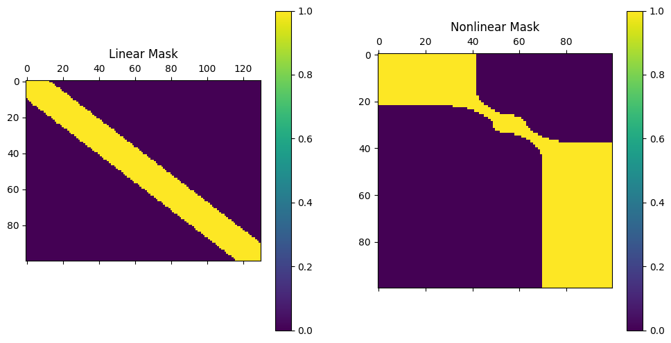

# Masking Map Optimal Transport For Sequential Data (MOT)

MOT introduce an optimal transport model based on constraint masks to guide the matching of other points in OT. There are two types of masks: the linear mask aims to preserve the relative positions of elements, and the nonlinear mask models the value relationships of elements with their adjacent neighbors.

The illustration for the mask is shown below:



Mask-based transport plan:


# Installation

```bash
python -m venv venv
venv\Scripts\activate
pip install -r requirements.txt
python setup.py develop
```

# Dataset
The UCR dataset collections can be found at: [UCR Dataset](https://www.timeseriesclassification.com/dataset.php).

The remaining datasets: MSR Sport Action3D, MSR Daily Activity3D, Spoken Arabic Digits can be found at [Multivariate Dataset](https://husteduvn-my.sharepoint.com/:f:/g/personal/nhung_ht194349_sis_hust_edu_vn/EktjS0FWA2ZJrZssbB3KLmsBo00fQualQr2SdkBGZm5mUg?e=t0FGKG). 

# Run MOT experiments
MOT with Linear Masking Map - LMOT
```bash
python .\Experiments\LMOT.py --algorithm_path .\Config\Algorithm\LMOT.json --data_path .\Config\Data\DataUnivariate.json --result_path .\Results\Experiment\LMOT\LMOT.txt
```

MOT with Nonlinear Masking Map - NMOT
```bash
python .\Experiments\NMOT.py --algorithm_path .\Config\Algorithm\NMOT.json --data_path .\Config\Data\DataMultivariate.json --result_path .\Results\Experiment\NMOT\NMOT.txt
```

MOT applied sub-sequence with Linear Masking Map - LMSOT
```bash
python .\Experiments\LMSOT.py --algorithm_path .\Config\Algorithm\LMSOT.json --data_path .\Config\Data\DataMultivariate.json --result_path .\Results\Experiment\LMSOT\LMSOT.txt
```

MOT applied sub-sequence with Nonlinear Masking Map - NMSOT
```bash
python .\Experiments\NMSOT.py --algorithm_path .\Config\Algorithm\NMSOT.json --data_path .\Config\Data\DataUnivariate.json --result_path .\Results\Experiment\NMSOT\NMSOT.txt
```
